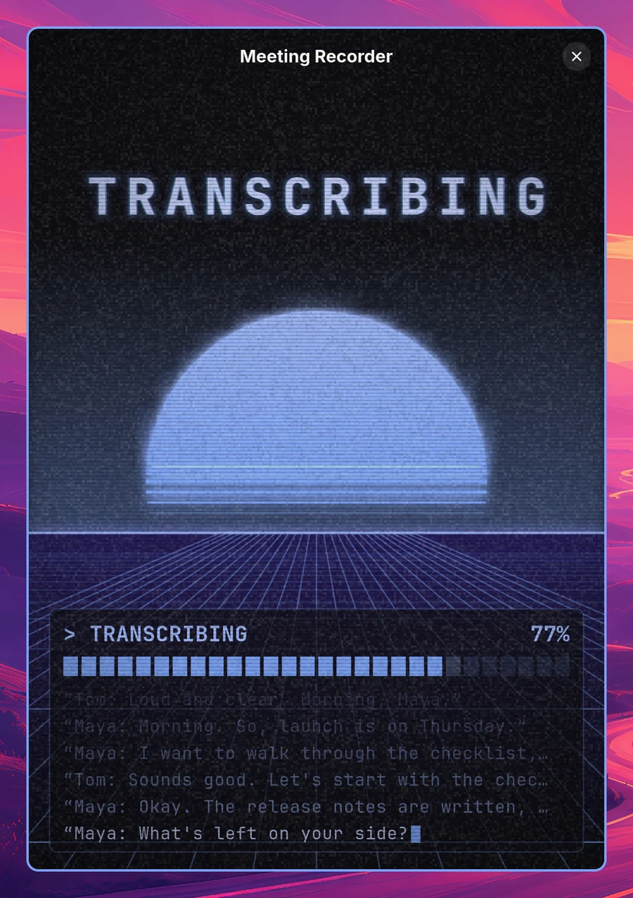

# Omarchy Meeting Recorder

**Record a meeting on [Omarchy](https://omarchy.org), your microphone and the computer audio as two tracks, and get a transcript with speakers, chapters and a player when you stop. The transcription runs on your own machine.**


Open the app and it records. Stop, and it transcribes the meeting with [whisper.cpp](https://github.com/ggml-org/whisper.cpp) while a 90s animation keeps you company. When it is done you get the transcript with who said what, a player to listen back from any line, and chapters written by the coding agent you already use.

<p align="center"></p>

[Watch the whole flow in 30 seconds (MP4)](screenshots/flow.mp4) · [State by state, close up (MP4)](screenshots/transitions.mp4) · [The transcribing animation (MP4)](screenshots/transcribing-loop.mp4)

## What it does

### Records both sides of the call

Opening the app starts recording right away. Your microphone and whatever your computer plays are captured as two separate tracks, and two live meters show that both actually carry sound. The meeting name, the audio format and the transcript language can all still be changed during the call.

<p align="center"></p>

### Stays out of the way

Press Ctrl+M, or the button in the header bar, and the window shrinks to a strip with only the two waves and the clock. Click it, or press Ctrl+M again, for the full window.

<p align="center"></p>

The bar widget shows the same while you record: a pulsing dot, a small waveform with the mic above the line and the computer audio below it, and the time. While the meeting is being transcribed it shows the progress instead. Clicking it brings the recorder window back.

<p align="center"></p>

### Transcribes on your own machine

When you stop, the window switches straight to the transcribing animation: first it saves the audio, then [whisper-rs](https://github.com/tazz4843/whisper-rs) transcribes the meeting with the `large-v3-turbo` model, and the lines type themselves out as they are recognised. Nothing is sent anywhere. The language is locked while this runs.

<p align="center"></p>

### Gives you a transcript you can listen to

The done screen puts the transcript on the right: the time, the speaker and the text in their own columns, grouped into one paragraph per turn. Above it sits a player with a waveform of both sides, your side above the line and the other side below it. Click or drag in the waveform to seek, or click any line to play from there. The line that is playing is highlighted and the transcript scrolls along.

On the left: the meeting name and the names of both speakers, which you can change at any time (the folder, the transcript and the manifest follow, and your own name is remembered for next time), the chapters, **Copy transcript** (also Enter), Open folder, New recording, and the language to transcribe again in.


<p align="center"></p>

It follows your theme, light ones included:


### Chapters by your default agent

When Omarchy has a default coding agent set (`omarchy default agent`, for instance Claude Code or Codex) and the meeting is three minutes or longer, the agent divides the transcript into chapters once it is done. They show up as a list on the left, as headings in the transcript and as markers on the waveform (hover for the title), and `transcript.md` gets a `## Chapters` list at the top, so a copied transcript carries them too. The Chapters header on the done page makes them again.

<p align="center"></p>

Chapters are an extra, not a requirement: without an agent the button is simply not there and everything else works the same. The agent runs without any tools. It gets the transcript and the instructions, and can only answer with text.

## What it writes to disk

Every meeting is a plain folder in `~/Documents/Meetings`, named `<YYYYMMDDHHMM> <name>`, so they sort by date:


Inside, the audio in the format you picked, the transcript, and a `.meeting-recorder` file that opens the meeting in the app when you double-click it:


With hidden files shown you also see `.tracks`, the two separate tracks the app keeps so it can transcribe the meeting again:


- `<name>.meeting-recorder`, a small JSON file with the title, start time, duration, audio format, language, speaker names and chapters. It has its own MIME type (`application/x-omarchy-meeting`), so double-clicking it opens the meeting in the app on the done page, with the settings the meeting was made with. The folder itself stays a plain folder.
- `transcript.md`, with the speaker and a timestamp on every line (and the chapters, when there are any)
- the audio in the format you picked:
  - **Mono**: `audio.ogg`, mic and computer audio mixed
  - **Stereo**: `audio.ogg`, mic on the left channel, computer audio on the right
  - **Separate files**: `mic.ogg` and `computer.ogg`
- `.tracks/mic.ogg` and `.tracks/computer.ogg`, a hidden copy of both tracks in mono. This is what Transcribe again uses, so the speakers stay apart whatever audio format you chose. Delete the directory if you do not need that.

Both tracks are always recorded separately, and each is levelled to the same speech loudness when it is saved, so a quiet microphone and a loud call end up equally easy to hear. The format can be switched until the moment you press stop.

## How it works

- **Recording.** The mic (`@DEFAULT_SOURCE@`) and the monitor of the default output (`@DEFAULT_MONITOR@`) are captured with `parec`. Because it follows the default output, switching to a headset during a call keeps working. `ffmpeg` encodes the audio to Opus when you stop.
- **Transcription.** After the call both tracks are mixed and transcribed in one pass with whisper-rs, using the `large-v3-turbo` model, so there is a single timeline. Long silences are skipped, which keeps whisper from inventing text in them, and word times come from whisper's attention alignment (DTW).
- **Who said what.** The speaker of each line is read off the two tracks, like whisper.cpp's `--diarize`: where the mic is louder it is you, where the computer audio is louder it is the other side. Echo of the other side in your mic, when you use speakers instead of a headset, is always quieter than the original, so it does not become a line of its own. When both people talk at the same time whisper follows the louder voice and the quieter one can get lost.
- **Imported files.** A single audio file has no second track to tell the speakers apart, so the voices themselves are told apart with sherpa-onnx's offline speaker diarization, run locally: pyannote's segmentation model finds stretches of one voice, a WeSpeaker ResNet34 model turns each stretch into a voice print, and the prints are clustered into "Speaker 1", "Speaker 2" and so on, in the order they first speak. The number of speakers is found automatically (voices heard for only a few seconds are folded into the nearest real speaker) or can be fixed. A sentence always goes to one speaker as a whole. It works best with a few people with clearly different voices; similar voices and fast back-and-forth can land on the wrong speaker, which the swap-speaker button fixes per line.
- **Chapters.** The recorder runs `omarchy-default-agent`'s agent headless and with every tool switched off, in an empty working directory, bounded in time and size. Agents that cannot run without tools are not used.
- **Playback.** `ffmpeg` decodes into `pacat`, so playing a meeting back needs nothing beyond what recording already uses.
- **The bar widget.** The app serves its live state on a Unix socket in `$XDG_RUNTIME_DIR`. `omarchy-meeting-recorder watch` relays it as NDJSON, which is what the widget reads.

### The model

The app looks for `ggml-large-v3-turbo.bin` in `~/.local/share/omarchy-meeting-recorder/models/`. If you use [voxtype](https://voxtype.io) and it already downloaded that model to `~/.local/share/voxtype/models/`, that copy is used. Otherwise the first transcription downloads it (about 1.6 GB) from [Hugging Face](https://huggingface.co/ggerganov/whisper.cpp). Importing a file downloads two small speaker models on first use (about 32 MB together) to the same directory: `pyannote-segmentation-3.0.onnx` and `wespeaker_en_voxceleb_resnet34_LM.onnx`. sherpa-onnx is compiled into the binary, so nothing else is needed at runtime.

## Privacy

The audio, the transcript and everything else stay on your computer. The only thing that leaves it is the transcript text for the chapters, and only when you have set a default agent: it goes to that agent's service, the one you already chose and pay for. No agent, no chapters, nothing sent.

## Requirements

- PipeWire with `parec` and `pacat` (both from `libpulse`), for recording and for playing a meeting back
- `ffmpeg` with libopus
- GTK 4 and libadwaita 1.6 or newer
- Rust and CMake, to build it (whisper.cpp is compiled along)
- Optional: a default agent in Omarchy for chapters

## Install

```bash
cargo build --release
ln -s "$PWD/target/release/omarchy-meeting-recorder" ~/.local/bin/omarchy-meeting-recorder
ln -s "$PWD/data/omarchy-meeting-recorder.desktop" ~/.local/share/applications/
mkdir -p ~/.local/share/mime/packages
ln -s "$PWD/data/omarchy-meeting-recorder.xml" ~/.local/share/mime/packages/
update-mime-database ~/.local/share/mime
xdg-mime default omarchy-meeting-recorder.desktop application/x-omarchy-meeting
```

The last three lines register the `.meeting-recorder` file type, so a double-click opens the meeting in the app. File managers that go through GIO (Nautilus) pick that up right away; restart Nautilus if it still opens the file as text. `xdg-open`, which most launchers and terminals use on Hyprland, looks at the contents with `file` instead and sees JSON, so it opens the file in your text editor. Install `perl-file-mimeinfo` (`yay -S perl-file-mimeinfo`) and `xdg-open` goes by the registered type too.

The default build transcribes on the CPU, which is fast enough on a modern machine: a few seconds for a short call. For the GPU, build with whisper.cpp's Vulkan backend. That needs the Vulkan headers and `glslc` (`vulkan-headers` and `shaderc` on Arch):

```bash
cargo build --release --features vulkan
```

The window floats nicely with a Hyprland rule on its class:

```lua
o.window("^com\\.jankeesvw\\.OmarchyMeetingRecorder$", { float = true })
o.window("^com\\.jankeesvw\\.OmarchyMeetingRecorder$", { size = { 480, 700 } })
o.window("^com\\.jankeesvw\\.OmarchyMeetingRecorder$", { center = true })
```

### Bar widget

The `plugin` directory is an Omarchy Quattro bar widget. It stays hidden until a recording starts.

```bash
ln -s "$PWD/plugin" ~/.config/omarchy/plugins/jankeesvw.meeting-recorder
omarchy-shell shell rescanPlugins
omarchy plugin enable jankeesvw.meeting-recorder
omarchy bar move jankeesvw.meeting-recorder --section right
```

## Command line

| Command | What it does |
|---|---|
| `omarchy-meeting-recorder` | Open the recorder and start recording right away |
| `omarchy-meeting-recorder <folder or .meeting-recorder file>` | Open a saved meeting on the done page |
| `omarchy-meeting-recorder stop` | Stop the running recording, for a keybinding |
| `omarchy-meeting-recorder compact` | Switch the recording window between full and compact |
| `omarchy-meeting-recorder watch` | Stream the recorder state as NDJSON, for the bar widget |
| `omarchy-meeting-recorder transcribe <mic> <computer> [--language xx]` | Transcribe two tracks and print the transcript as Markdown |
| `omarchy-meeting-recorder ask "<prompt>" < text` | Run a prompt over stdin through the default agent, without tools (`ask --agent` shows which agent that is) |

For example:

```bash
omarchy-meeting-recorder transcribe mic.ogg computer.ogg --language en > transcript.md
```

Any format ffmpeg can read works. `--language` takes `auto` (the default), `en`, `nl`, `de`, `fr`, `es`, `it` or `pt`.

### Using it

- **The name** stays editable all the time. After the transcript is done, changing it (Enter, or leaving the field) renames the meeting folder and the heading in the transcript.
- **Closing** while recording or transcribing asks first. You can stop and close, let the transcription finish in the background and quit afterwards, or cancel the transcription; the audio is kept either way. Ctrl+W and Ctrl+Q ask the same question.

## The screenshots

The meeting in the screenshots and clips is invented and was voiced with [piper](https://github.com/rhasspy/piper). `demo/` has the script and the steps to shoot them again.

## License

MIT
